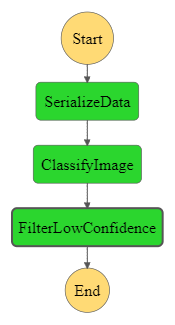

# Udacity-AWS-ML-project-2
This is my submission to the AWS Machine Learning nanodegree  - project 2

## Project structure
Main Python notebook for the project is named [`starter.ipynb`](./starter.ipynb)

AWS lambda functions are in three python files: 
* [`serializeImageData.py`](./serializeImageData.py),
* [`classifyimageData.py`](./classifyimageData.py),
* [`filterLowConfidence.py`](./filterLowConfidence.py)

Step function code file: [`stateMachine.json`](./stateMachine.json). Graph:

